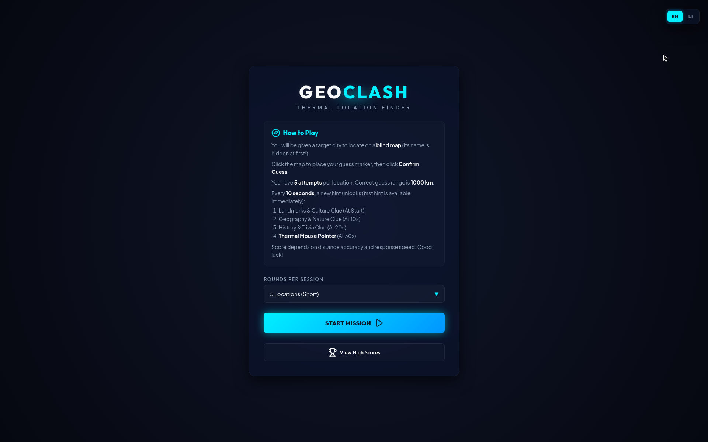
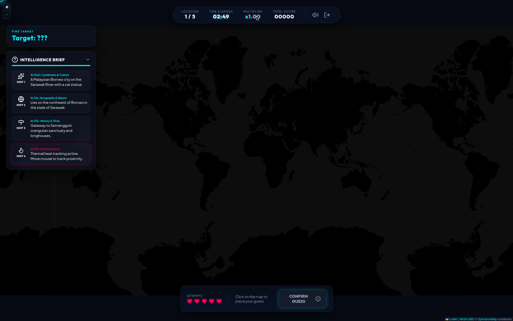
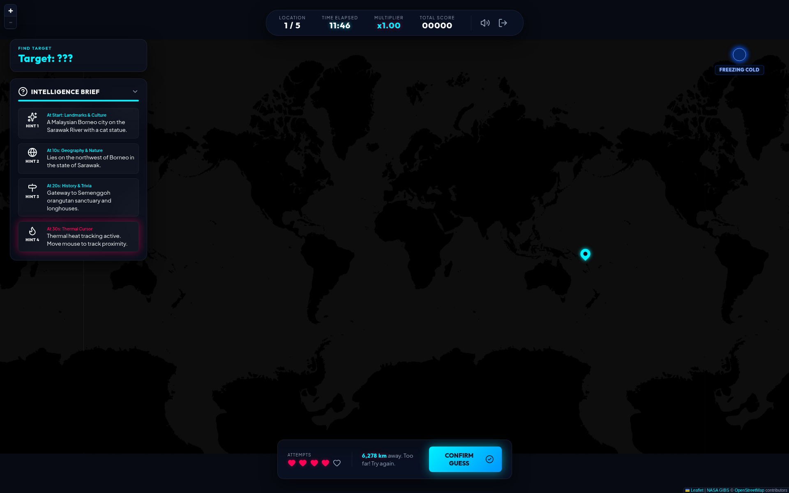

# GeoClash

Thermal location finder: locate mystery cities on a **blind map**. Hints unlock over time, and a thermal cursor gets hotter as you near the target.

English and Lithuanian UI. Play in the browser — no account, no map API key.



## Screenshots

Blind unlabeled world map (NASA GIBS land/water) with the HUD and intelligence brief:



Guess placed, thermal readout, and distance feedback:



## How to play

1. Pick a session length (5, 10, or 20 locations) and start a mission.
2. Read the clues. The city name stays hidden at first.
3. Click the map to drop a marker, then confirm.
4. You get **5 attempts** per city. A hit counts if you are within **1000 km**.
5. Hints unlock on a timer:
   - Landmarks & culture — immediately
   - Geography & nature — 10s
   - History & trivia — 20s
   - Thermal mouse pointer — 30s
6. Score rewards accuracy and speed.

## Features

- Unlabeled dark world map (no city or country names)
- Thermal proximity cursor after the last hint
- Image gallery and lightbox for revealed locations
- Local high scores
- EN / LT language switch

The basemap is [NASA GIBS](https://earthdata.nasa.gov/gibs) OSM land/water imagery, with OpenStreetMap data. It needs no API key.

## Run locally

```bash
npm install
npm run dev
```

Then open the URL Vite prints (default `http://localhost:3000`).

```bash
npm run build
npm run preview
```

## License

MIT — see [LICENSE](LICENSE).
